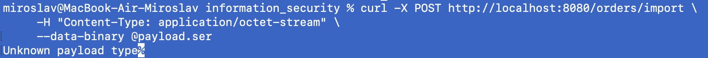
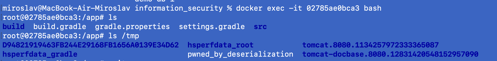
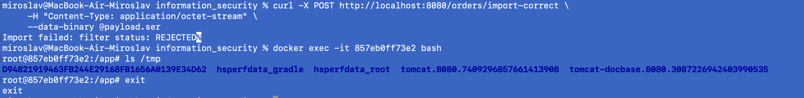

# Java Deserialization 
**Java Deserialization** (Небезопасная десериализация Java) - это критическая уязвимость, при которой приложение принимает сериализованные Java-объекты из ненадёжного источника и восстанавливает их без проверки. Атакующий может подменить данные так, что при десериализации на сервере выполнится произвольный код (RCE), что делает эту уязвимость одной из самых опасных в Java-экосистеме.

Создадим метод, принимаю сериализованный Java-объект.

```
@PostMapping(value = "/orders/import", consumes = "application/octet-stream")
    public ResponseEntity<String> importOrder(@RequestBody byte[] data) {
        try (ObjectInputStream ois = new ObjectInputStream(new ByteArrayInputStream(data))) {
            Object obj = ois.readObject();

            if (obj instanceof OrderImport dto) {
                Order order = new Order();
                order.setProductType(dto.getProductType());
                order.setQuantity(dto.getQuantity());
                Order saved = orderRepository.save(order);
                return ResponseEntity.ok("id = " + saved.getId());
            }

            return ResponseEntity.badRequest().body("Unknown payload type");
        } catch (Exception e) {
            return ResponseEntity.badRequest().body("Import failed: " + e.getMessage());
        }
    }
```
Для этого добавил сущность

```
@Getter
@Setter
@NoArgsConstructor
@AllArgsConstructor
public class OrderImport implements Serializable {

    private Long id;

    private Order.ProductType productType;

    private String quantity;
}
```


Данный метод принимает сериализованный Java-объект, десериализует без проверок в OrderImport, затем достает данные и кладет в Order, затем кладет в БД

Нужно сформировать сериализованный Java-объект. Для этого используем инструмент ysoserial.
ysoserial — это популярный инструмент с открытым исходным кодом, предназначенный для генерации вредоносных нагрузок , которые эксплуатируют уязвимости небезопасной десериализации данных в Java

Инструмент автоматизирует создание цепочек вызовов (gadget chains). Цепочка вызовов (gadget chain) - это последовательность существующих в приложении функций, которые при передаче им специально подготовленных данных последовательно вызывают друг друга, приводя в итоге к выполнению вредоносного действия.

Сгенерируем сериализованный объект. Инструмент сгенерирует объект, который будет определен как сериализованный Java-объект, и подложит команду, которая создаст файл(в данном случае команда демонстративная, которая дает понимание опасности этой уязвимости)
```
java -jar ysoserial.jar CommonsCollections6 'touch /tmp/pwned_by_deserialization' > payload.ser
```

CommonsCollections6 - указывает утилите использовать конкретную цепочку гаджетов (Gadget Chain)

```
/*
	Gadget chain:
	    java.io.ObjectInputStream.readObject()
            java.util.HashSet.readObject()
                java.util.HashMap.put()
                java.util.HashMap.hash()
                    org.apache.commons.collections.keyvalue.TiedMapEntry.hashCode()
                    org.apache.commons.collections.keyvalue.TiedMapEntry.getValue()
                        org.apache.commons.collections.map.LazyMap.get()
                            org.apache.commons.collections.functors.ChainedTransformer.transform()
                            org.apache.commons.collections.functors.InvokerTransformer.transform()
                            java.lang.reflect.Method.invoke()
                                java.lang.Runtime.exec()

    by @matthias_kaiser
*/
```

Источник - https://github.com/frohoff/ysoserial/blob/master/src/main/java/ysoserial/payloads/CommonsCollections6.java

Сериализованный объект собирается так, чтобы был вызван метод java.util.HashSet.readObject(), а далее цепочка привела к java.lang.Runtime.exec(), который и исполнит наш скрипт. 
Вообще у инструмента есть несколько таких цепочках, которые используют уязвимости разных коллекций, разных версий Java. CommonsCollections6 использует как раз таки java.util.HashMap
 

Отправим сгенерированный объект в эндпоинт


Unknown payload type логичный ответ, так как эндпоинт не смог десериализовать объект, но readObject() выполнен был, значит цепочка запущена и ожидаем выполнение нашего скрипта.

Проверим создался ли файл


Файл создался, значит скрипт выполнился.

Теперь создадим метод, где решим данную проблему.

```
    @PostMapping(value = "/orders/import-correct", consumes = "application/octet-stream")
    public ResponseEntity<String> importOrderCorrect(@RequestBody byte[] data) {
        // Создаём фильтр: разрешаем только OrderImport и его зависимости, всё остальное отклоняем
        ObjectInputFilter filter = ObjectInputFilter.Config.createFilter(
                "nsu.security.demoapplication.model.OrderImport;" +  // ваш DTO
                        "nsu.security.demoapplication.model.Order$ProductType;" + // enum внутри Order
                        "java.lang.String;" +   // quantity
                        "java.lang.Long;" +     // id
                        "!*"                    // всё остальное — запрещено
        );

        try (ObjectInputStream ois = new ObjectInputStream(new ByteArrayInputStream(data))) {
            ois.setObjectInputFilter(filter);

            Object obj = ois.readObject();

            if (obj instanceof OrderImport dto) {
                Order order = new Order();
                order.setProductType(dto.getProductType());
                order.setQuantity(dto.getQuantity());
                Order saved = orderRepository.save(order);
                return ResponseEntity.ok("id = " + saved.getId());
            }

            return ResponseEntity.badRequest().body("Unknown payload type");
        } catch (Exception e) {
            return ResponseEntity.badRequest().body("Import failed: " + e.getMessage());
        }
    }
```

Здесь добавили фильтр ObjectInputFilter, в который добавили список классов, которые ожидаем для сериализации. Теперь как только ObjectInputStream доходит до байтов, описывающих структуру HashSet, он обращается к фильтру. Фильтр смотрит на имя класса, если этого класса нет в списке разрешенных объектов, фильтр возвращает статус Status.REJECTED

Проверим


Исправление реализовано успешно

Также немного отрефактирил код, добавил lombok и креды к БД вынес в env.